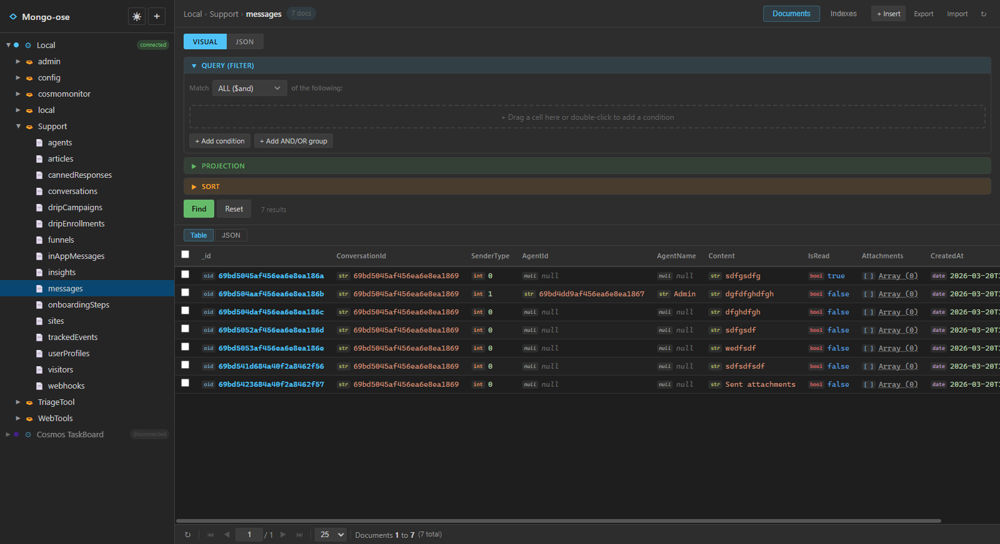
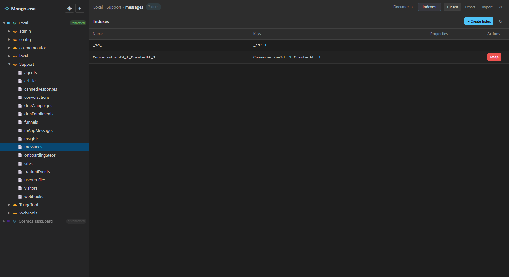

<p align="center">
  
</p>

<p align="center">
  <strong>A lightweight, self-hosted MongoDB management tool — browse data, inspect indexes, and import/export collections.</strong>
</p>

---

## What is Mongo-ose?

Mongo-ose is a **web-based MongoDB browser** that gives you a clean interface for the things you actually need: connecting to databases, browsing documents, checking indexes, and moving data around. No bloat, no license keys, no electron app eating 2GB of RAM.

It's a personal project — built because I wanted something simple and fast for day-to-day MongoDB work. If you find it useful, great. If you find a bug, [raise an issue](https://github.com/paulallington/Mongo-ose/issues).

## Features

- **Connection management** — save multiple MongoDB connections with colour-coded labels, test before connecting
- **Database tree browser** — expandable sidebar showing connections, databases, and collections
- **Document viewer** — table and JSON view modes with type-aware rendering (ObjectId, Date, Boolean, etc.)
- **Visual query builder** — build filter, projection, and sort queries without writing JSON by hand
- **JSON query mode** — switch to raw JSON when you need full control
- **Document editing** — edit documents in a Monaco editor, insert new documents, duplicate or delete existing ones
- **Index viewer** — see all indexes on a collection, create new indexes, drop existing ones
- **Import / Export** — import and export data as JSON or CSV
- **Copy & paste** — copy documents between collections (even across connections) with Ctrl+C / Ctrl+V
- **Pagination** — configurable page sizes (10–500), keyboard navigation between pages
- **Dark / Light mode** — toggle with one click
- **Context menus** — right-click on connections, databases, and collections for quick actions

## Screenshots

### Document Table View
<p align="center">
  
</p>

### Index Viewer
<p align="center">
  
</p>

## Getting started

### Prerequisites

- [Node.js](https://nodejs.org/) v18+
- A MongoDB instance to connect to

### Install & run

```bash
git clone https://github.com/paulallington/Mongo-ose.git
cd Mongo-ose
npm run install:all
npm run dev
```

Open [http://localhost:5173](http://localhost:5173) in your browser. The server runs on port 3001.

### Build for production

```bash
npm run build
npm start
```

## How it works

Mongo-ose is a client/server app:

- **Client** — React + TypeScript, built with Vite. Uses Zustand for state management, Monaco Editor for document editing, and react-contexify for context menus.
- **Server** — Express + TypeScript, using the official MongoDB Node.js driver. Handles connections, queries, and import/export.

Connection details are stored locally in `server/data/connections.json` — they never leave your machine.

## Project structure

```
Mongo-ose/
  client/
    src/
      components/       — React components (documents, indexes, tree, layout, etc.)
      stores/            — Zustand state management
      api/               — API client
      types/             — TypeScript types
  server/
    src/
      routes/            — Express route handlers
      services/          — Connection manager
      middleware/         — Error handling
    data/                — Local connection storage (gitignored)
```

## Contributing

This is a personal project, but contributions are welcome. If you run into a problem, [open an issue](https://github.com/paulallington/Mongo-ose/issues). If you want to add something, send a pull request and I'll take a look.

## License

See [LICENSE](LICENSE) for details.

---

<p align="center">
  A <a href="https://www.thecodeguy.co.uk">The Code Guy</a> project
</p>
